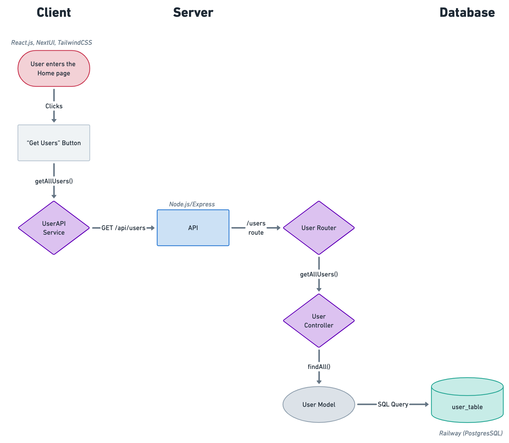

# StockPulse

**CodePath WEB103 Final Project**

**Designed and developed by:** Priscilla Colon, Sebastian Nunez

🔗 **Link to deployed app:**

## Table of Contents

- [About](#about)
- [Features](#features)
- [Getting Started](#getting-started)
- [Technologies](#technologies)
- [System Design](#system-design)
  - [High Level](#high-level)
  - ["Get All Users" Trace](#get-all-users-trace)
- [User Stories](#user-stories)
- [ER Diagram](#er-diagram)
- [Tables](#tables)
  - [`product`](#product)
  - [`category`](#category)
  - [`tag`](#tag)
  - [`product_tag`](#product_tag)
- [Wireframes](#wireframes)
- [License](#license)

## About

**Description:** An efficient and intuitive inventory management application designed for e-commerce businesses.

**Purpose:** To streamline your stock control, categorize products, track sales, and manage your inventory seamlessly.

**Inspiration:** StockPulse was created with the vision to promote growth and customer satisfaction while effortlessly overseeing and organizing their products and sales.

## Features

- **Product Management:**

  - Add, update, and remove products with ease.
  - Categorize and tag products for efficient organization.

- **Inventory Control:**

  - Monitor product quantities and make adjustments as needed.
  - Receive low-stock alerts for timely restocking.

- **Category & Tag Management:**

  - Create, update, and remove categories and tags for products.
  - Assign products to multiple tags.

- **User-friendly Interface:**
  - Browse products, view details, and manage the shopping cart effortlessly.

## Getting Started

1. **Clone the repository:** `git clone https://github.com/sebastian-nunez/stock-pulse`
2. **Set up the backend:**
   - Navigate to the backend directory: `cd server`
   - Install dependencies: `npm install`
   - Update the environment variables: rename `.env.template` to `.env` and fill in variables
   - Run the backend server: `npm run start`
3. **Set up the frontend:**
   - Navigate to the frontend directory: `cd client`
   - Install dependencies: `npm install`
   - Run the frontend app: `npm run dev`
4. Open your browser and visit [http://localhost:5173](http://localhost:5173) to access StockPulse.

**Note:** Service currently relies on `Railway` for database hosting and management. You can sign up and host your own instance. [Learn more about Railway](https://railway.app/)

## Technologies

- **Languages:** JavaScript, Node.js
- **Frameworks:** React.js (Vite), Express.js
- **UI Components:** NextUI, TailwindCSS, Lucide Icons
- **Database:** PostgreSQL
- **Hosting:** Railway
- **Design:** Whimsical

## System Design

### High Level

### "Get All Users" Trace

_Diagram ignores any authentication/authorization measures_.

## User Stories

### As an Admin, I want to:

1. **Manage Products:**

   - Add new products to the inventory, including their name, description, and price.
   - Update product details like name, description, and price.
   - Remove products from the inventory.

2. **Categorize & Tag Products:**

   - Add new categories or tags for products.
   - Assign products to one category or multiple tags.
   - Update category or tag details.
   - Remove categories or tags.

3. **Manage Inventory:**
   - View a list of products and their current inventory levels.
   - Adjust the quantity of products in the inventory (e.g., add stock, remove stock).

## ER Diagram

_ER Diagram to be added soon..._

## Tables

In this schema, we have the following relationships:

1. **One-to-Many Relationship (Category to Products):**

   - Each product belongs to one category.

2. **Many-to-Many Relationship (Products to Tags):**
   - Products can have multiple tags, and each tag can be associated with multiple products.

### `product`

Stores information about individual products.

| Field         | Type          | Description                                                 |
| ------------- | ------------- | ----------------------------------------------------------- |
| product_id    | SERIAL        | Unique identifier for the product                           |
| name          | VARCHAR(100)  | Name of the product                                         |
| brand         | VARCHAR(100)  | Brand or manufacturer of the product                        |
| description   | VARCHAR(255)  | Description of the product                                  |
| image         | VARCHAR(255)  | Image of the product                                        |
| quantity      | INT           | Quantity of the product in stock                            |
| price         | MONEY         | Price of the product in USD                                 |
| is_available  | BOOLEAN       | Information about the product's availability (true/false)   |
| weight        | DECIMAL(10,2) | Weight of the product (in lbs)                              |
| dimensions    | VARCHAR(50)   | Dimensions of the product (Length x Width x Height)         |
| warranty_info | VARCHAR(255)  | Details about the product's warranty                        |
| notes         | TEXT          | Any notes about the product                                 |
| date_added    | DATE          | Date when the product was added to the inventory            |
| category_id   | INT           | Foreign key referencing a category                          |

### `category`

Stores information about product categories.

| Field       | Type         | Description                        |
| ----------- | ------------ | ---------------------------------- |
| category_id | SERIAL       | Unique identifier for the category |
| name        | VARCHAR(25)  | Name of the category               |
| description | VARCHAR(255) | Description of the category        |

### `tag`

Stores information about product tags. Ex. Discounted, Hotsale, Rebate etc.

| Field       | Type         | Description                   |
| ----------- | ------------ | ----------------------------- |
| tag_id      | SERIAL       | Unique identifier for the tag |
| name        | VARCHAR(25)  | Name of the tag               |
| description | VARCHAR(255) | Description of the tag        |

### `product_tag`

Establishes a many-to-many relationship between products and tags.

| Field       | Type                 | Description                      |
| ----------- | -------------------- | -------------------------------- |
| product_id  | INT                  | Foreign key referencing products |
| tag_id      | INT                  | Foreign key referencing tags     |
| PRIMARY KEY | (product_id, tag_id) | Composite primary key            |

## Wireframes

_Wireframes to be added soon..._

## License

This project is licensed under the [MIT License](https://github.com/sebastian-nunez/stock-pulse/blob/main/LICENSE)
