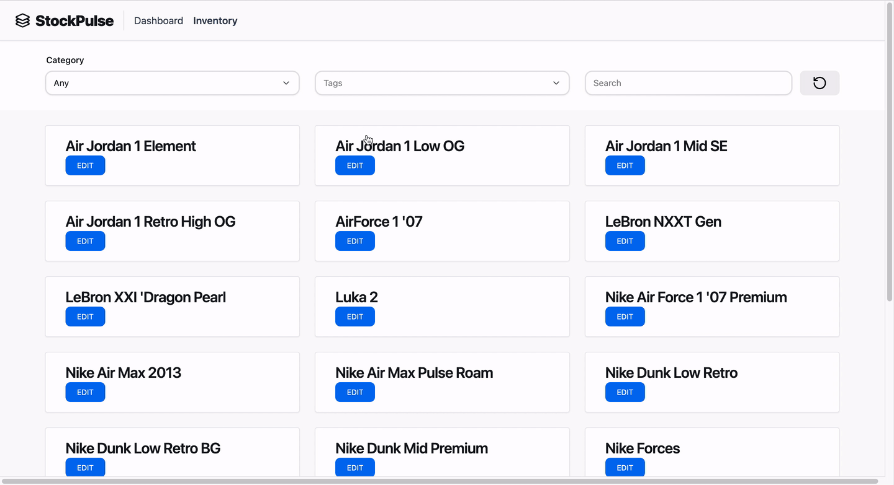

# Milestone 4

This document should be completed and submitted during **Unit 8** of this course. You **must** check off all completed tasks in this document in order to receive credit for your work.

## Checklist

This unit, be sure to complete all tasks listed below. To complete a task, place an `x` between the brackets.

- [x] Update the status of issues in your project board as you complete them
- [x] In `readme.md`, check off the features you have completed in this unit by adding a ✅ emoji in front of their title
  - [x] Under each feature you have completed, **include a GIF** showing feature functionality
- [x] In this document, complete the **Reflection** section below

### Product Inventory Grid

> Within the Inventory view, users will be able to see the most relevant details about a product. Also, they're able to click on an item and expand all it's details; moreover, users can edit an item.

### Filtering Capabilities

> Users are able to filter items by their, related tags, and category.

### Responsive Design & Accessibility

> StockPulse was design with a responsive architecture while following the latest WAI-ARIA accessability standards to accommodate a mobile and desktop experience.

### E2E Type Validation

## Reflection

### 1. What went well during this unit?

We got the product browser/inventory view set up alongside some notification and user friendly-error messages for both the frontend and the backend.

### 2. What were some challenges your group faced in this unit?

Creating the Product Info/edit/create forms and modals were difficult. There were a couple of new technologies that were implemented via documentation.

### Did you finish all of your tasks in your sprint plan for this week? If you did not finish all of the planned tasks, how would you prioritize the remaining tasks on your list?

Yes. We need to make the category and tag modals alongside the table view "dashboard". After that, we can work on creating the landing page alongside the login via OAuth.

### Which features and user stories would you consider “at risk”? How will you change your plan if those items remain “at risk”?

None

### 5. What additional support will you need in upcoming units as you continue to work on your final project?

Setting up OAuth.
