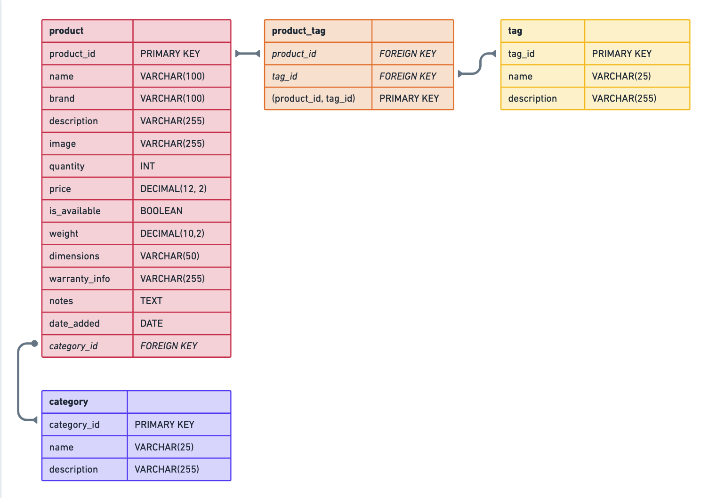

# Entity Relationship Diagram

Reference the Creating an Entity Relationship Diagram final project guide in the course portal for more information about how to complete this deliverable.

## Add the Entity Relationship Diagram

## Create the List of Tables

In this schema, we have the following relationships:

1. **One-to-Many Relationship (Category to Products):**

   - Each product belongs to one category.

2. **Many-to-Many Relationship (Products to Tags):**
   - Products can have multiple tags, and each tag can be associated with multiple products.

### `product`

Stores information about individual products.

| Field         | Type          | Description                                               | Constraints                                   |
| ------------- | ------------- | --------------------------------------------------------- | --------------------------------------------- |
| product_id    | SERIAL        | Unique identifier for the product                         | Primary Key                                   |
| name          | VARCHAR(100)  | Name of the product                                       | Not Null, Unique                              |
| brand         | VARCHAR(100)  | Brand or manufacturer of the product                      | Not Null                                      |
| description   | VARCHAR(255)  | Description of the product                                | Not Null                                      |
| image         | VARCHAR(255)  | Image of the product                                      | Not Null                                      |
| quantity      | INT           | Quantity of the product in stock                          | Not Null                                      |
| price         | MONEY         | Price of the product in USD                               | Not Null                                      |
| is_available  | BOOLEAN       | Information about the product's availability (true/false) | Not Null, true or false                       |
| weight        | DECIMAL(10,2) | Weight of the product (in lbs)                            | Not Null                                      |
| dimensions    | VARCHAR(50)   | Dimensions of the product (Length x Width x Height)       | Default: "Unknown."                           |
| warranty_info | VARCHAR(255)  | Details about the product's warranty                      | Default: "No warranty information available." |
| notes         | TEXT          | Any notes about the product                               |                                               |
| date_added    | DATE          | Date when the product was added to the inventory          | Not Null, Default: CURRENT_DATE               |
| category_id   | INT           | Foreign key referencing a category                        | Foreign Key, ON DELETE SET NULL               |

### `category`

Stores information about product categories.

| Field       | Type         | Description                        | Constraints                         |
| ----------- | ------------ | ---------------------------------- | ----------------------------------- |
| category_id | SERIAL       | Unique identifier for the category | Primary Key                         |
| name        | VARCHAR(25)  | Name of the category               | Not Null, Unique                    |
| description | VARCHAR(255) | Description of the category        | Default: "No description provided." |

### `tag`

Stores information about product tags. Ex. Discounted, Hotsale, Rebate etc.

| Field       | Type         | Description                   | Constraints                         |
| ----------- | ------------ | ----------------------------- | ----------------------------------- |
| tag_id      | SERIAL       | Unique identifier for the tag | Primary Key                         |
| name        | VARCHAR(25)  | Name of the tag               | Not Null, Unique                    |
| description | VARCHAR(255) | Description of the tag        | Default: "No description provided." |

### `product_tag`

Establishes a many-to-many relationship between products and tags.

| Field       | Type                 | Description                      | Constraints                    |
| ----------- | -------------------- | -------------------------------- | ------------------------------ |
| product_id  | INT                  | Foreign key referencing products | Foreign Key, ON DELETE CASCADE |
| tag_id      | INT                  | Foreign key referencing tags     | Foreign Key, ON DELETE CASCADE |
| PRIMARY KEY | (product_id, tag_id) | Composite primary key            | Primary Key                    |
